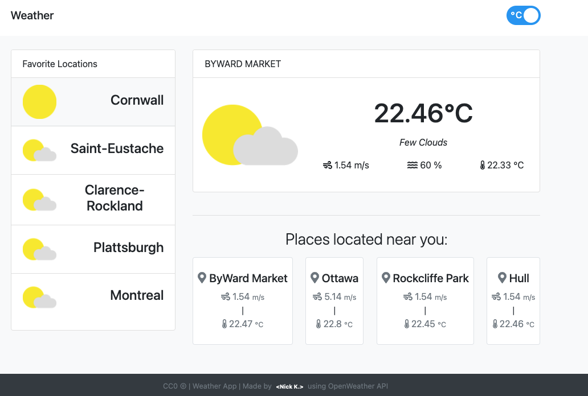

# REACT Weather App

> Weather App app built with REACT and OpenWeather API.



## Quick Start

Make sure you've installed node

```bash
# Add .env file and set the environment variable with your API KEY from OpenWeather
find more info here https://openweathermap.org/api

# Install dependencies
npm install

# Run the React app (client)
npm run start

# Run test
npm run test

# App runs on http://localhost:3000

# Run build (It is included to the repo as it was mentioned in the requirements)
serve -s build

# App runs on http://localhost:5000
```

### Author

MK
[MK](https://github.com/kalapyha)

### Version

1.0.0
